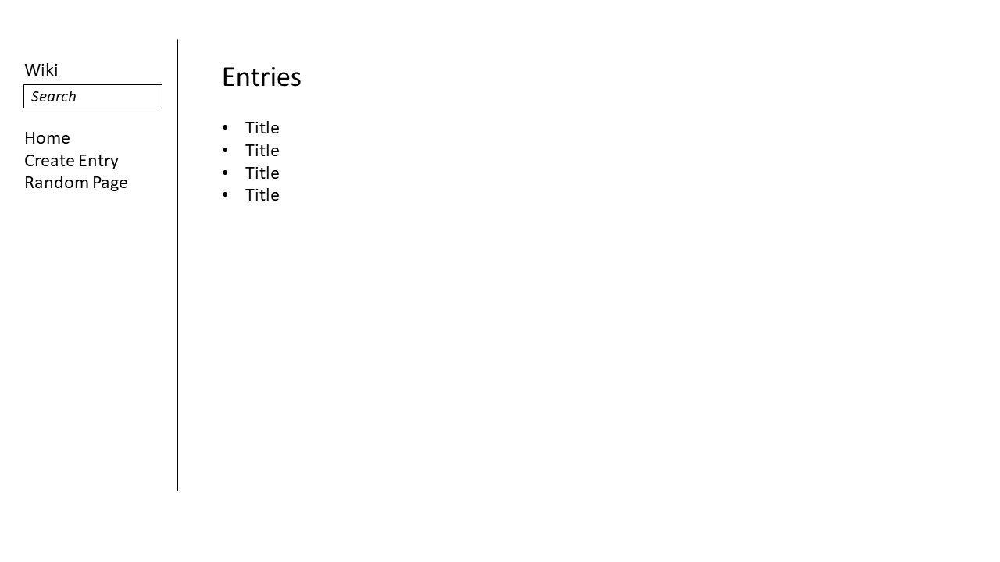
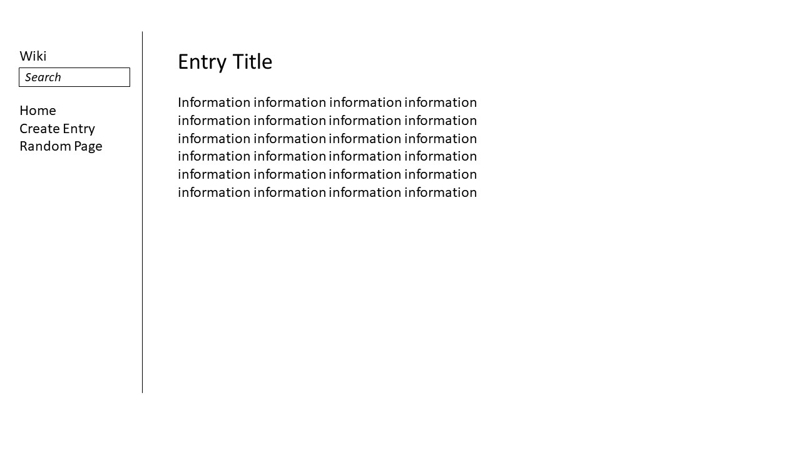
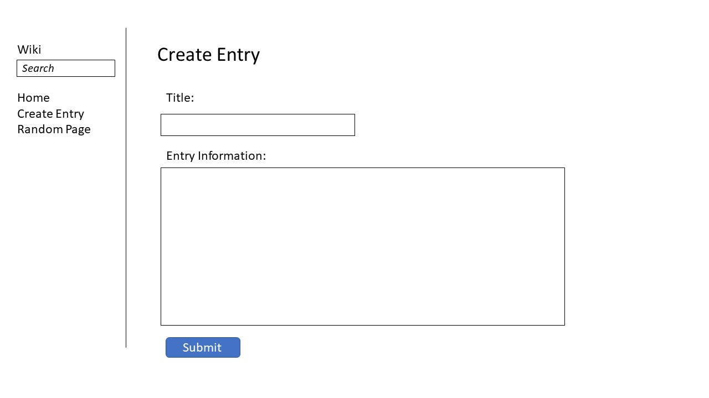
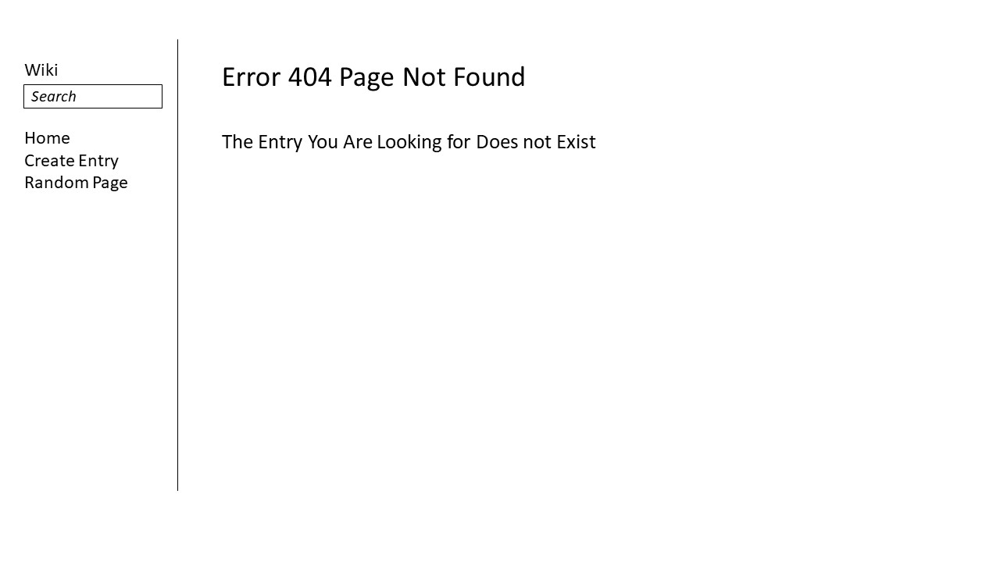

# Design Document Wiki

In this project a webpage will be constructed that will form a simplistic form of Wikipedia.
On this page it will be possible to see all entries on the homepage, create a new entry, visit a random page and search for and visit an entry. When an entry isn’t available an error page will be displayed.

## Index
On this page the user will be able to navigate to the available entries, these will be listed on the main body. The user will also be able to navigate to create an entry, a random page and the user will be able to input a search term to navigate to an existing entry.

## Entry page
This page will display the entry with a title and a body with the entry information text.

## Create entry
On this page a user will be able to create a new entry, which will be saved as a markdown file. The user will be able to input an entry title and the information text of the entry.

## Error
The user will be sent to his page when they try to access an entry that does not exist.

